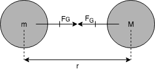

# Fysik Grundkurs

## SI-systemet

Fysikaliska storheter mäts i det internationella SI-systemet (system internationale). Det bygger på att det finns **sju** grundenheter.

| Storhet         | Enhet          |
| --------------- | -------------- |
| Längd           | Meter, $m$     |
| Massa           | Kilogram, $kg$ |
| Tid             | Sekunder, $s$  |
| Elektrisk ström | Ampere, $A$    |
| Temperatur      | Kelvin, $K$    |
| Ljusstyrka      | Candela, $cd$  |
| Substansmängd   | Mol, $mol$     |

Dessa enheter kan kombineras, så som hastighet ($m/s$).

Grundregeln är att alltid använda SI-systemets enheter i formler för att få ett svar i enheter från systemet. Använd inte prefix utan skriv grundpotensform.

_Systemet kan komma att ändras väldigt snart. Diskussioner har förts de senaste åren om att basera systemet på naturkonstanter som ljusets hastighet,  elektrisk laddning och Avogadros konstant._

## Newtowns lagar

Den resulterande kraften tecknas här $F_{res}$.

| Teckning                     | Beskrivning                              |
| ---------------------------- | ---------------------------------------- |
| $F_{res}$                    | Den resulterande kraften                 |
| $v$                          | Hastigheten ($m/s$)                      |
| $m$                          | Massa ($kg$)                             |
| $a$                          | Acceleration ($m/s^2$)                   |
| $F_G$                        | Gravitationskraften                      |
| $G$                          | Gravitationskraftkonstanten. $G=6.673*10^{-11} Nm^2/kg^2$ |
| $F_E$                        | Den elektromagnetiska kraften            |
| $g$                          | Gravitationskonstanten ./assets/kg$ vid ekvatorn. |
| $g$                          | Tyngdacceleration. Samma värde som $g$ men i enheten $N/s^2$. Det är inte universalt så - snarare slumpen på jorden. |
| $k$                          | Fjäderkonstanten. En materialkonstant. En styv fjäder har stora värden, en mjuk små. |
| $\delta$                     | Förlängning ($m$)                        |
| $S$                          | Spännkraft                               |
| $N$                          | Normalkraft                              |
| $F_f$                        | Friktionskraft                           |
| $  \unicode[serif]{x03BC}_s$ | Det statiska friktionstalet              |
| $  \unicode[serif]{x03BC}_k$ | Glidfriktionstalet / glidfriktionskoefficienten. K:et står för kinetisk. |

### 1. Tröghetslagen

Egentligen tillskrivs lagen Galileo Galilei, men den står ändå under Newtons lagar. Lagen gäller ett föremål.

> En kropp utan yttre kraftpåverkan behåller sitt rörelsetillstånd. Det vill säga förblir i vila eller fortsätter med konstant hastighet.

$$
F_{res}=0 \iff \Delta v = 0
$$

### 2. Accelerationslagen / Kraftlagen

Lagen gäller ett föremål.

> Den resulterande kraften är lika med massa multiplicerat med accelerationen.

$$
F_{res}=ma
$$

### 3. Lagen om verkan och motverkan

Lagen gäller två föremål.

> Mot varje kraft svarar en annan lika stor och motsatt riktad kraft så att det ömsesidigt mellan de två kropparna verkande krafterna alltid är lika stora och motsatt riktade.

## Krafter

Det finns generellt sett endast fyra olika typer av krafter. Andra krafter är inte annat än en sammansättning av de andra krafterna.

### 1. Gravitationskraft

Newtons allmäna gravitationslag.

> Gravitationskraften mellan två föremål beror på de motsatta och avståndet mellan tyngdpunkterna och en konstant.

$$
G=6.673*10^{-11} Nm^2/kg^2 \\
F_G = G*\frac{mM}{r^2}
$$
Värdet $F_G$ som fås är gravitationskraften från $m$ till $M$ **och** gravitationskraften från $M$ till $m$.

### 2. Elektromagnetiska krafter

Kraften som verkar på två ledningarna.

$$
F_E=k*\frac{Q_1Q_2}{r^2}
$$
_Notera: lika laddningar repellerar, olika attraherar._

#### Exempel: Olika laddningar

### 3. Stark kärnkraft

Denna kraft är ansvarig för att kärnpartiklar i en atomkärna som borde repellera på grund av laddningar ändå hålls samman.

### 4. Svag kärnkraft

### Tyngdkraft

##### Elastiska kontaktkrafter (Hookes lag)

I följande figur vidrör handen fjädern.

I följande figur drar handen ut fjädern med en kraft $F_f$.

$$
F_f=k\delta
$$
_Hook var ungefär samtida med Newton. De var ej goda vänner. Publikationer tog lång tid och då och då hände det att andra kommer på samma eller liknande teorem etc. Hook skrev denna lag på latin och kastade om bokstäverna innan publikation. Efter detta gick han ut med att han besatt något som berörde fjädrar och uppmanade andra att berätta om de gjorde detsamma. När ingen återkom publicerades Hooks upptäckt._

### Kontaktkrafter

|                 Linkraft                 |               Normalkraft                |              Friktionskraft              |
| :--------------------------------------: | :--------------------------------------: | :--------------------------------------: |
|  |

#### Friktionskraft (forts.)

| Vilofriktion                             | Fullt utbildad friktion                  | Glidfriktion                      |
| ---------------------------------------- | ---------------------------------------- | --------------------------------- |
| Här är $F_{res}=0$ innan föremålet rör på sig. Vidare är $F_{drag}=F_f$. | Precis innan föremålet börjar röra på sig. $F_{max}=\unicode[serif]{x03BC}_sN$ | $F_f=  \unicode[serif]{x03BC}_kN$ |

I allmänhet gäller att $ \unicode[serif]{x03BC}_k \lt  \unicode[serif]{x03BC}_s$. Detta betyder att det är lättare att röra på något i rörelse än att få något att röra på sig.

